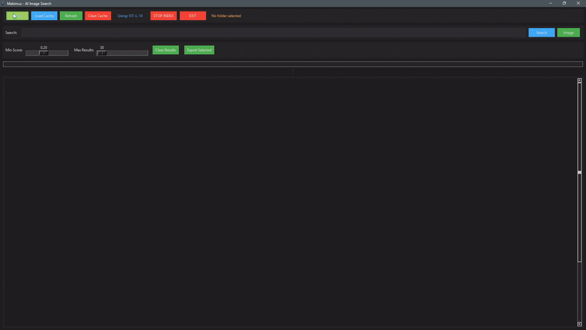
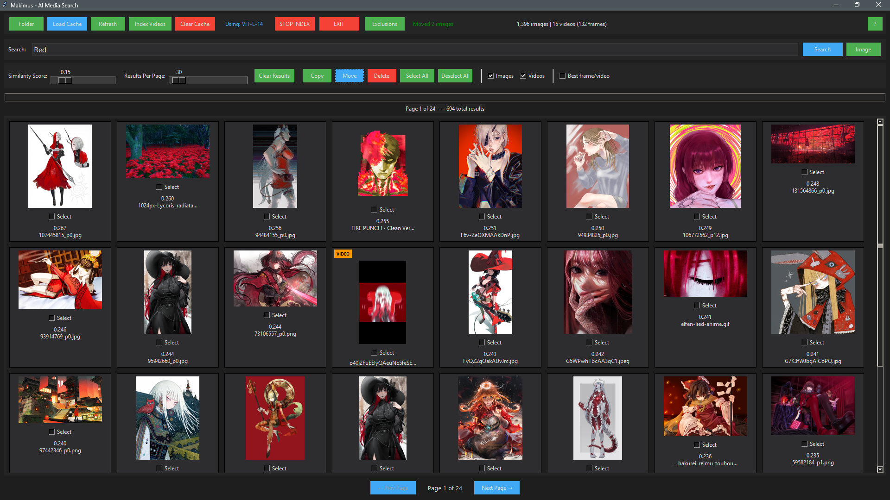

# 🦉 Makimus-AI — AI Media Search

[](https://creativecommons.org/licenses/by-nc-sa/4.0/)

Search your entire image and video library using **natural language or an image** — type what you're looking for or drop an image, and Makimus-AI instantly finds matching results using AI. Works on photos, RAW files, and **videos**.

> Type *"girl in red armor"* or *"dog playing in snow"* — or click **Image** to search by visual similarity. Supports text-to-image, image-to-image, **text-to-video**, and **image-to-video** search.



<br><br><br>



---

## 💛 Support the Developer

Makimus-AI is completely **free and open source**. If it saves you time and you'd like to support continued development, any amount is appreciated!

| Method | Address |
|--------|---------|
| 💳 PayPal | [paypal.me/UbaidahYusuf](https://www.paypal.me/UbaidahYusuf) |
| ₿ Bitcoin (BTC) | `32Ztk8P3zMavx51usno2adnDiZzLmZL42y` |
| 💵 USDT — TRC-20 (Tron) | `TYwaZ2xNqHUYDXH83teMSNtWfYETiBAEDk` |

---

## ⚙️ Requirements

- Python 3.10, 3.11, or 3.12
- NVIDIA GPU (recommended) — or AMD GPU with DirectML on Windows
- CPU mode works but is much slower
- Windows / Linux / macOS

---

## 🐍 Installing Python

If you don't have Python installed, follow the steps for your operating system.

### Windows
1. Go to [python.org/downloads](https://www.python.org/downloads/) and download Python **3.11** (recommended)
2. Run the installer — **check "Add Python to PATH"** before clicking Install
3. Open a terminal and verify: `python --version`

### macOS
```bash
# Using Homebrew (recommended):
brew install python@3.11

# Or download the installer from python.org/downloads
```

### Linux (Ubuntu / Debian / Kubuntu)
```bash
sudo apt update
sudo apt install python3 python3-pip python3-venv python3-tk
```

> **Verify your install:** `python3 --version` — should show 3.10, 3.11, or 3.12.

---

## 🚀 Installation

### Windows — Easy Install

**1. Clone the repo:**
```bash
git clone https://github.com/Ubaida-M-Yusuf/Makimus-AI.git
cd Makimus-AI
```

**2.** Double-click **`Install.bat`** — it creates a virtual environment, installs all dependencies, and launches the app automatically.

Use **`Run.bat`** every time you want to start the app after that.

> **Note:** `Install.bat` installs CUDA 12.8 PyTorch and is intended for NVIDIA GPU users. AMD or CPU-only users should follow the manual installation steps below.

---

### Manual Installation

**1. Clone the repo:**
```bash
git clone https://github.com/Ubaida-M-Yusuf/Makimus-AI.git
cd Makimus-AI
```

**2. Linux only — install system dependencies:**
```bash
sudo apt install python3-tk python3-pip libgl1 libglib2.0-0 ffmpeg
```
> This step is required on Linux. `libgl1` and `libglib2.0-0` are needed by OpenCV, `ffmpeg` is needed for video support, and `python3-tk` is needed for the GUI. Skip this step on Windows and macOS.

**3. Create a virtual environment:**
```bash
python -m venv venv
```

**4. Activate the virtual environment:**

**Windows (Git Bash):**
```bash
source venv/Scripts/activate
```

**Windows (Command Prompt):**
```bat
venv\Scripts\activate
```

**Mac / Linux:**
```bash
source venv/bin/activate
```

**5. Install dependencies — pick the right command for your GPU:**

**NVIDIA GPU — All modern cards (RTX 20xx, 30xx, 40xx, 50xx):**
```bash
pip install -r requirements.txt
```

> **Older NVIDIA GPUs (GTX 900 series and earlier):** If installation fails or CUDA is not detected, try CUDA 12.6 instead:
> ```bash
> pip install Pillow==12.0.0 numpy==2.2.6 open_clip_torch==3.2.0 rawpy==0.26.1 opencv-python==4.13.0.92 Send2Trash==2.1.0
> pip install torch==2.9.1+cu126 torchvision==0.24.1+cu126 --index-url https://download.pytorch.org/whl/cu126
> ```

**Apple Silicon (MPS) — GPU acceleration built in, no extras needed:**
```bash
pip install Pillow==12.0.0 numpy==2.2.6 open_clip_torch==3.2.0 rawpy==0.26.1 opencv-python==4.13.0.92 Send2Trash==2.1.0
pip install torch==2.10.0 torchvision==0.25.0
```

**No NVIDIA GPU / CPU only:**
```bash
pip install Pillow==12.0.0 numpy==2.2.6 open_clip_torch==3.2.0 rawpy==0.26.1 opencv-python==4.13.0.92 Send2Trash==2.1.0
pip install torch==2.10.0 torchvision==0.25.0
```

**AMD GPU — Windows (DirectML):**
```bash
pip install Pillow==12.0.0 numpy==2.2.6 open_clip_torch==3.2.0 rawpy==0.26.1 opencv-python==4.13.0.92 Send2Trash==2.1.0
pip install torch==2.10.0 torchvision==0.25.0
pip install torch-directml
```

**AMD GPU — Linux (ROCm):**

ROCm requires a separate PyTorch build and is not officially supported. If you want to try it, visit [pytorch.org](https://pytorch.org/get-started/locally) and select ROCm as the compute platform. Note that only RX 6000 and RX 7000 series GPUs are well supported. If ROCm setup fails the app will fall back to CPU automatically.

**Optional (legacy): ONNX acceleration**

Only useful on older NVIDIA GPUs. **Requires code changes inside `Makimus-AI.py` to enable — not plug and play.**
```bash
pip install onnxruntime-gpu==1.23.2
```

---

## ▶️ Run
```bash
# Make sure your venv is active, then:
python Makimus-AI.py
```

Windows users can double-click **`Run.bat`**.

---

## 🔄 Updating
```bash
# Pull latest code
git pull
```

Then update dependencies. **Important: uninstall PyTorch first** — pip will not correctly switch CUDA versions without this step:
```bash
pip uninstall torch torchvision -y
pip install -r requirements.txt
```

> Your existing cache files are fully compatible — no re-indexing needed after an update.

---

## 📖 How to Use

### First Launch
1. Launch the app — on **first run it will automatically download the AI model (~1.7 GB)** from HuggingFace. This only happens once and is cached locally.
2. Click **Folder** and select the folder containing your images and/or videos.
3. If no index exists for that folder, a popup will ask if you want to index it — click **Yes** to start. To index videos separately, use the **Index Videos** button.
4. Indexing runs in the background with a progress bar. You can start searching before it finishes.

### Searching
- **Text search:** Type any description in the search box and press Enter or click **Search**
  - Examples: *"sunset over ocean"*, *"person in blue jacket"*, *"fight scene"*
  - **Negative terms:** Add a minus sign before a word to exclude it — *"cat -dog"* finds cats without dogs
- **Image search:** Click the **Image** button next to the search box and select any image — the app finds visually similar results from your entire library
- Use the **Similarity Score** slider to tune results:
  - Lower = more results, broader match
  - Higher = fewer results, closer match

### Working with Results
- **Single click** a thumbnail → opens the file location in Explorer / Finder / Dolphin
- **Double click** a thumbnail → opens the file in your default viewer / player
- **Right-click** a thumbnail → context menu: open, show in folder, copy to folder, move to folder, delete to recycle bin, select/deselect
- **Click and drag** on empty canvas space → rubber-band select multiple results at once
- Use the **Show Images / Show Videos** toggles to filter what's displayed

### Video Search
- Video results show a thumbnail of the matching frame with a timestamp (e.g. `t=1:23`)
- **Best Frame mode** — disabled by default. When enabled, the app finds and displays the single best-matching frame from across the entire video rather than the nearest sampled frame. Useful when you want one clean representative result per video. Enable it using the toggle in the interface.
- Double-clicking a video result opens it in your default player

### File Operations
- Select results using right-click or rubber-band drag, then use the toolbar to **Export** (copy) or **Move** them to any folder
- **Delete to Recycle Bin** — right-click any result to safely delete it. Files go to your system Recycle Bin and can be recovered if needed
- Selection is preserved after copy/move so you can chain operations (e.g. copy to one folder, then move to another) without reselecting

### Managing Your Index
- **Refresh** — scans your folder for new or deleted files and updates the index incrementally without re-processing everything. **This is the correct way to update your index after adding new files.**
- The cache is stored inside your media folder and detected automatically next time you open that folder. **Renaming or moving the folder does not break the cache** — relative paths are used internally.
- Cache management is automatic — the app protects existing cache from accidental overwrites and only updates what has changed.

---

## 💡 Features

- 🔍 **Text-to-image search** — find images by describing them in plain English
- 🖼️ **Image-to-image search** — find visually similar images using a query image
- 🎬 **Text-to-video search** — search your entire video library using text descriptions
- 🎬 **Image-to-video search** — find video frames visually similar to a query image
- ➖ **Negative search terms** — exclude unwanted content with minus prefixes
- 📷 **RAW photo support** — full indexing and display for ARW, CR2, NEF, DNG, ORF, RW2, RAF, PEF, SR2
- 🎞️ **Video support** — MP4, MKV, MOV, AVI, WEBM, M4V, WMV, FLV, TS, MPG and more
- ⚡ **GPU accelerated** — CUDA (NVIDIA), Apple MPS, DirectML (AMD/Intel on Windows)
- 🧠 **Auto-tuning** — detects VRAM and adjusts batch sizes automatically
- 🔄 **Search while indexing** — no need to wait for indexing to finish
- 💾 **Smart incremental cache** — only new or changed files are processed on refresh
- 🖱️ **Rubber-band multi-select** — drag to select multiple results at once
- 📁 **Export / Move selected** — copy or move search results to any folder
- 🗑️ **Delete to Recycle Bin** — safely remove files via right-click, recoverable from Recycle Bin
- 🐧 **Linux support** — tested on Kubuntu with KDE/X11

---

## 📦 Dependencies

| Package | Version | Purpose |
|---------|---------|---------|
| Pillow | 12.0.0 | Image decoding |
| numpy | 2.2.6 | Vector math |
| torch | 2.10.0+cu128 | GPU inference |
| torchvision | 0.25.0+cu128 | Image transforms |
| open_clip_torch | 3.2.0 | CLIP model |
| rawpy | 0.26.1 | RAW photo support |
| opencv-python | 4.13.0.92 | Video support |
| Send2Trash | 2.1.0 | Delete to Recycle Bin |
| torch-directml | latest | ⚙️ Optional — AMD/Intel GPU on Windows |
| onnxruntime-gpu | 1.23.2 | ⚙️ Optional legacy ONNX (requires code changes) |

---

## 🧠 Model

| Property | Value |
|----------|-------|
| Model | ViT-L-14 |
| Pretrained on | laion2b_s32b_b82k |
| Library | open_clip_torch |
| Download size | ~1.7 GB (automatic on first run, cached locally) |

---

## 📝 Notes

- The model downloads automatically on first launch (~1.7 GB) — this only happens once
- Cache files are stored inside your media folder — keep them for instant future searches
- After adding new files, use **Refresh** to update the index
- Renaming or moving the indexed folder does not break the cache
- CPU-only mode works but indexing will be significantly slower

---

## 🤝 Contributing

This project is not open for direct contributions.
If you'd like to improve it, feel free to **fork** the repo and build your own version!

[](https://github.com/Ubaida-M-Yusuf/Makimus-AI/fork)
